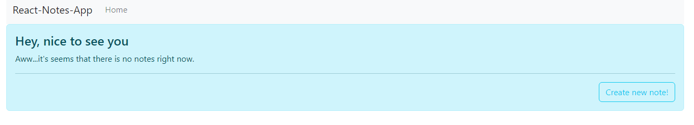
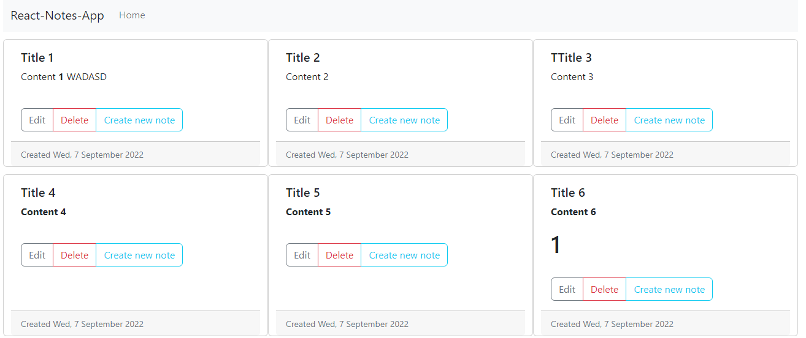
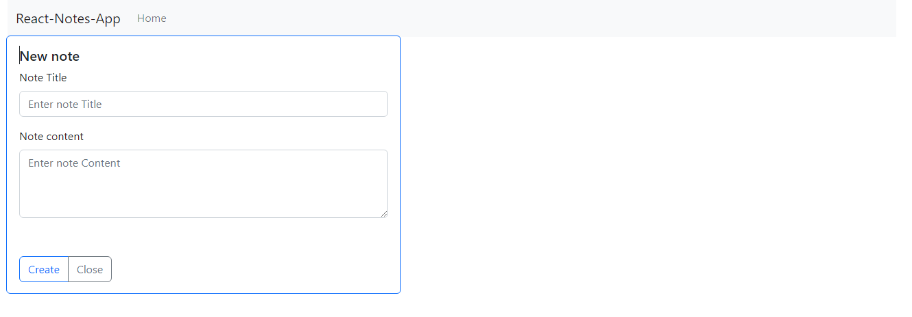
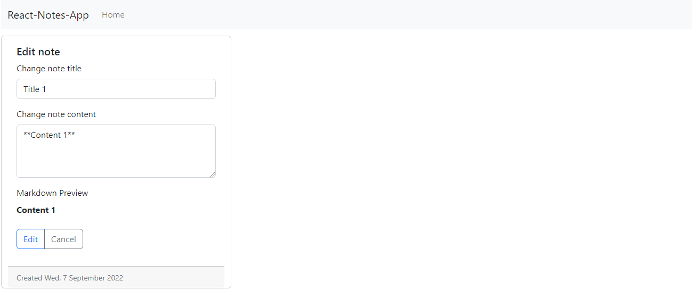

# React-notes-app

This project is a simple practise of React

## Features
You can 
*   [x] **create**,**delete** and **modify** notes.
*   [x] Data storage in browser.
*   [x] Markdown compability in note's body .

### Installation
Run `npm i` to install all dependencies then `npm start`

### Images

